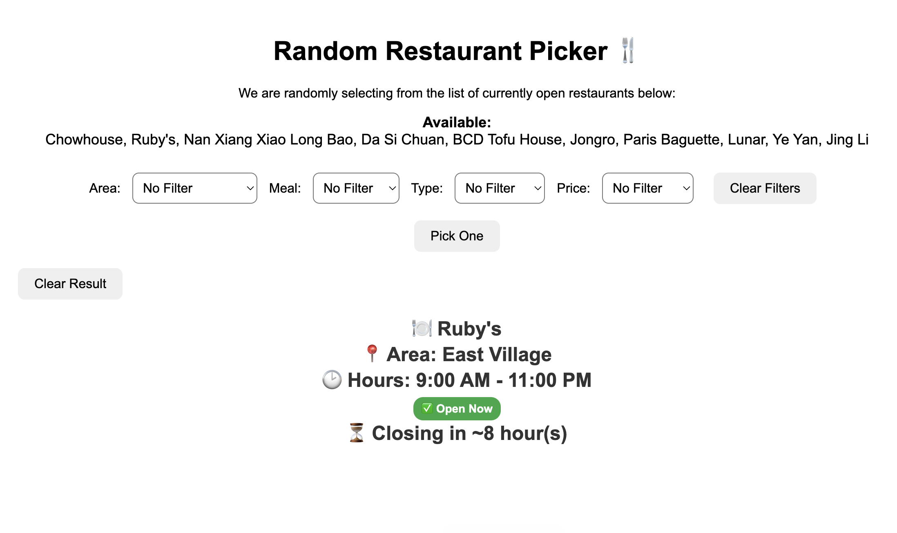

> _"Can't decide where to eat? Let randomness decide for you!"_

# Random Restaurant Picker 🍴

This is a simple, responsive website that helps users **randomly pick a restaurant** based on **filters** like area, meal type, cuisine type, price level, and real-time opening hours. I built this to prevent me from wasting too much time thinking about what to eat every day. Currently, it contains a list of restaurants in the New York City area. All restaurant information is stored in a **CSV file** (`restaurants.csv`) for convenience to expand.

## 🌟 Features

- Randomly pick a restaurant from a live filtered list.
- Filters by:
  - **Area** (location)
  - **Meal** (breakfast, brunch, lunch, dinner)
  - **Type** (cuisine type)
  - **Price** (cheap, medium, expensive)
- Only shows restaurants **currently open** based on **current time**.
- Visual status indicator:
  - ✅ Open Now
  - 🕒 Closing Soon (within 1 hour)
  - ❌ Closed
- Countdown until closing time.
- Animated "rolling dice" spinner during random selection.
- Fully **mobile responsive** (accessible on phones or tablets).

## 📄 Categories and Options

### Area

- East Village
- Ktown
- Times Square
- Long Island City
- Flushing
- Jersey City

### Meal

- Breakfast
- Brunch
- Lunch
- Dinner

### Type

- Chinese
- Korean
- Thai
- Western
- Fast Food

### Price

- Cheap
- Medium
- Expensive

---

## 📁 Project Structure

```
/ (root)
├── index.html        # Main website file
├── restaurants.csv   # Restaurant data
├── screenshot.png    # Screenshot of the website
└── README.md         # This file
```

## 🛠️ How It Works

1. **Restaurants are loaded** from `restaurants.csv` using [PapaParse](https://www.papaparse.com/).
2. Filters (Area, Meal, Type, Price) are applied **live** as the user selects options.
3. Only **currently open** restaurants are listed and eligible for selection.
4. A random restaurant is picked with a short animation.
5. Displayed information includes name, area, open/close hours, and real-time open status.

## ⚡ How to Use

There are two ways you can use this tool:

### 1. Directly Visit Online

You can immediately use the website hosted at:  
👉 [https://nyonyoko.github.io/what_to_eat/](https://nyonyoko.github.io/what_to_eat/)

- This version is **ready to use**.
- However, **you cannot add new restaurants** directly through the website (yet).
- Only the restaurants currently in the CSV will appear.

### 2. Clone the Repository Locally

If you want to **add your own restaurants**, you must:

1. **Clone or download** the repository.
2. Open `restaurants.csv` in a text editor and manually add new entries.
3. Open `index.html` locally in your browser.
4. The updated restaurants will appear automatically.

_(In the future, functionality to add restaurants directly on the website will be developed!)_

## ✍️ How to Add New Restaurants Locally

1. Open `restaurants.csv`.
2. Add a new line with the following format:

```csv
name,area,meals,type,price,open,close
```

Example:

```csv
Ruby's,East Village,Brunch;Lunch,Western,Medium,9:00,23:00
```

✅ Use commas `,` to separate the fields.

✅ Use semicolons `;` to separate multiple areas, meals, types, or prices.

✅ Times must be in **24-hour `HH:MM` format** (e.g., `11:00`, `21:45`).

## 🚀 Future Plans

- Allow users to add new restaurants directly from the website interface.
- Add Google Maps links for selected restaurants.
- Show restaurant images or logos.
- Allow multiple selections in filters.
- Add a search function.
- Move restaurant data to the backend to improve security and privacy.
- Support user accounts and favorites.

## 📷 Screenshot



## 💬 License

This project is open-source and free to use.

## ⚡ Note

Currently, users **cannot dynamically add new restaurants** through the [nyonyoko.github.io/what_to_eat](https://nyonyoko.github.io/what_to_eat/) website.  
You must manually edit the CSV file locally if you want to expand the list for now.
